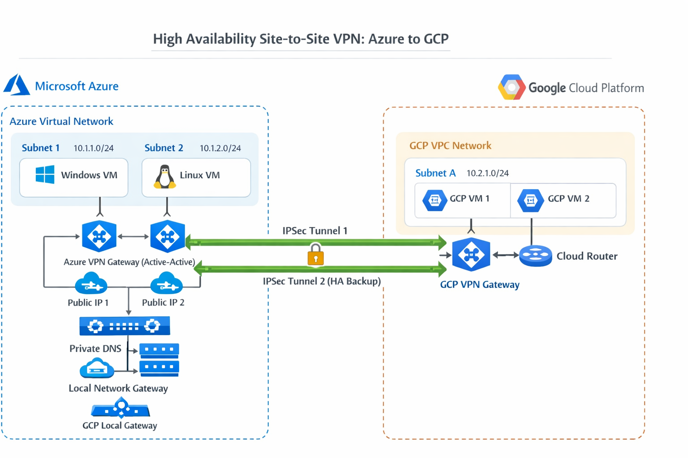

# 🌐 Multi-Cloud HA Site-to-Site VPN (Azure ↔ GCP)

## 📌 Overview

Designed and implemented a **High Availability (HA) Site-to-Site VPN** between **Microsoft Azure** and **Google Cloud Platform (GCP)** to enable secure, private, and resilient communication across multi-cloud environments.

This project demonstrates real-world cloud networking, hybrid connectivity, and fault-tolerant architecture design using enterprise-grade cloud services.

---

## 🏗️ Architecture

  

### 🔹 Key Components

### Azure Side:

* Virtual Network (VNet)
* VPN Gateway (Active-Active Configuration)
* Public IP Addresses (2 instances)
* Local Network Gateway (GCP representation)
* Private DNS Resolver
* Network Security Groups (NSG)

### GCP Side:

* VPC Network
* Cloud VPN Gateway
* HA VPN Tunnels (2 tunnels)
* Cloud Router (for dynamic routing)

---

## 🔄 Architecture Flow

1. Azure VNet and GCP VPC act as isolated private networks
2. VPN Gateways are deployed on both sides
3. Two IPSec tunnels are established for **high availability**
4. Traffic flows securely between clouds using encrypted tunnels
5. Failover occurs automatically if one tunnel goes down

---

## 🚀 Features

* ✔ High Availability (Active-Active VPN setup)
* ✔ Multi-cloud connectivity (Azure + GCP)
* ✔ Secure IPSec encrypted communication
* ✔ Redundant VPN tunnels (fault tolerance)
* ✔ Network isolation using NSGs
* ✔ Private DNS resolution across networks
* ✔ Scalable and production-like architecture

---

## 📸 Screenshots

All configurations and resources are documented via screenshots:

### Azure:

* VNet Configuration
* VPN Gateway (HA Setup)
* Connection 1 & Connection 2
* Public IP Assignments
* Local Network Gateways
* NSG Rules (Windows & Linux)
* Private DNS Resolver

### GCP:

* VPC Network
* VPN Gateway
* Tunnel Configuration
* Routing Setup

---

## ⚙️ Implementation Steps

### 🔹 Azure Configuration

1. Create Virtual Network (VNet)
2. Create Gateway Subnet
3. Deploy VPN Gateway (Active-Active mode)
4. Assign two Public IPs
5. Configure Local Network Gateway (GCP side)
6. Establish VPN Connections (2 tunnels)
7. Configure NSG rules
8. Set up Private DNS Resolver

---

### 🔹 GCP Configuration

1. Create VPC Network
2. Create Cloud VPN Gateway
3. Configure HA VPN (2 tunnels)
4. Configure Cloud Router
5. Define routing between networks

---

## 🔐 Security

* IPSec encryption for secure communication
* Controlled access using NSGs
* Private network isolation
* No public exposure of internal services

---

## ⚠️ Challenges Faced

* IPSec parameter compatibility between Azure and GCP
* Route propagation and synchronization issues
* HA tunnel configuration and failover validation
* Cost management for persistent cloud resources
* Debugging cross-cloud connectivity

---

## 📚 Key Learnings

* Deep understanding of hybrid & multi-cloud networking
* Hands-on experience with HA VPN architectures
* Cloud-native networking differences (Azure vs GCP)
* Troubleshooting real-world networking issues
* Importance of cost optimization in cloud environments

---

## 🛠️ Tools & Technologies

* Microsoft Azure
* Google Cloud Platform (GCP)
* Networking (VNet, VPC, VPN, Routing)
* IPSec Protocol
* CLI (Azure CLI, gcloud CLI)

Optional Enhancements:

* Monitoring using Prometheus
* Visualization using Grafana

---

## 📈 Future Improvements

* Infrastructure as Code using Terraform
* Automated deployment pipelines (CI/CD)
* Monitoring and alerting integration
* Traffic analysis and logging
* Multi-region expansion

---

## 🏆 Project Impact

Architected and implemented a **high-availability multi-cloud VPN solution** enabling secure, fault-tolerant communication between Azure and GCP, simulating enterprise-grade hybrid cloud networking.

---

## 👨‍💻 Author

Rajat Rai
Cloud & DevOps Engineer